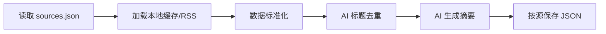

# 新闻胶囊 - 产品需求文档 (PRD)

> **产品愿景**：像吞服胶囊一样简单，在最短时间内获取不应错过的科技资讯

---

## 1. 产品概述

### 1.1 产品定位
一个「有限内容」的科技新闻阅读网站，通过每日精选高质量科技要闻，帮助用户：
- ✅ 不错过重要信息（大公司动向、新产品发布、行业变化）
- ✅ 快速了解事件背景与潜在影响
- ✅ 明确「读完了」的边界感，避免无限信息流焦虑

### 1.2 目标用户
- 科技从业者、产品经理、投资人
- 对科技行业感兴趣但时间有限的职场人士
- 希望高效获取信息而非沉浸式刷新闻的用户

### 1.3 核心差异化
| 传统新闻网站       | 新闻胶囊         |
| ------------------ | ---------------- |
| 无限信息流         | 按信息源分组展示 |
| 标题党吸引点击     | 一句话讲清楚事件 |
| 追求阅读时长       | 追求高效阅读     |
| 需要用户判断重要性 | 已预筛选重要信息 |

---

## 2. 功能规格

### 2.1 首页 - 按源分组展示

#### 页面结构
```
┌─────────────────────────────────────────────┐
│  💊 新闻胶囊                    [订阅更新]   │
├─────────────────────────────────────────────┤
│  📅 2026年1月5日 · 12 条资讯    [日期选择]   │
├─────────────────────────────────────────────┤
│                                             │
│  ▼ The Verge (5)                            │
│  ├── [新闻卡片 1]                           │
│  ├── [新闻卡片 2]                           │
│  └── [新闻卡片 3...]                        │
│                                             │
│  ▶ 极客公园 (7) [折叠状态]                   │
│                                             │
├─────────────────────────────────────────────┤
│  ✅ 更新完毕                                 │
└─────────────────────────────────────────────┘
```

#### 新闻卡片设计
每张卡片包含：
- **标题**：一句话概括事件（15-30字）
- **摘要**：核心要点的完整描述（100-200字）
- **阅读原文推荐**：1-5分评分 + 推荐理由
- **阅读时长**：预估原文阅读时间
- **来源**：原始信息来源链接

```
┌─────────────────────────────────────────────┐
│ Apple发布Vision Pro 2，售价降至2499美元     │
│                                             │
│ 苹果公司今日发布了第二代 Vision Pro 头显，  │
│ 重量减轻40%，新增空间视频录制功能...         │
│                                             │
│ ⭐⭐⭐⭐ 推荐阅读原文                        │
│ 原文包含详细的技术规格和发布时间表           │
│                                             │
│ 📎 来源：Apple Newsroom · 5分钟阅读         │
└─────────────────────────────────────────────┘
```

### 2.2 订阅弹窗

点击「订阅更新」按钮后显示模态框：
```
┌─────────────────────────────────────────────┐
│           📬 订阅每日科技速递                │
│                                             │
│  每天早8点，将今日要闻发送到您的邮箱          │
│                                             │
│  ┌─────────────────────────────────────┐    │
│  │ 请输入邮箱地址                       │    │
│  └─────────────────────────────────────┘    │
│                                             │
│           [确认订阅]                        │
│                                             │
│  已有 1,234 位读者订阅                      │
└─────────────────────────────────────────────┘
```

> [!NOTE]
> MVP阶段仅收集邮箱，暂不发送邮件。

### 2.3 管理后台 (/admin)

- 信息源管理：添加、编辑、启用/禁用 RSS 源
- 同步状态监控：查看各源的最后同步时间和文章数量
- 手动触发生成：可手动执行新闻生成流程

---

## 3. 技术架构

### 3.1 技术栈选择

| 层级         | 技术                        | 理由                                      |
| ------------ | --------------------------- | ----------------------------------------- |
| **前端框架** | Next.js 16 (App Router)     | Vercel原生支持、SSG优化SEO、适合Agent开发 |
| **样式**     | Vanilla CSS + CSS Variables | 轻量、无依赖、易于Agent理解和修改         |
| **AI 摘要**  | OpenAI GPT-4o-mini          | 筛选、摘要生成、去重                      |
| **正文提取** | html-to-text                | 从 HTML 提取干净纯文本                    |
| **数据存储** | JSON文件（按源分组）        | 便于维护和扩展                            |
| **部署**     | Vercel                      | 自动部署、Cron定时任务                    |

### 3.2 项目结构

```
news-capsule/
├── app/
│   ├── layout.js          # 全局布局
│   ├── page.js            # 首页 (按源分组展示)
│   ├── globals.css        # 全局样式
│   ├── admin/             # 管理后台
│   └── api/
│       ├── feeds/route.js # ⭐ 主要 API
│       ├── dates/route.js # 可用日期
│       └── subscribe/     # 订阅API
├── components/
│   ├── Header.js          # 顶部导航
│   ├── SourceGroup.js     # ⭐ 信息源分组组件
│   ├── NewsCard.js        # 新闻卡片组件
│   ├── DatePicker.js      # 日期选择器
│   ├── Footer.js          # 底部
│   └── SubscribeModal.js  # 订阅弹窗
├── scripts/
│   ├── generate-news.js   # ⭐ 新闻生成脚本
│   └── config.js          # Prompt 配置
├── data/
│   ├── sources.json       # ⭐ 信息源配置
│   ├── feeds/             # ⭐ 按源分组的数据
│   │   └── {sourceId}/
│   │       ├── items.json           # RSS 原始数据
│   │       └── {date}-{lang}.json   # AI 处理后的摘要
│   └── subscribers.json   # 订阅者邮箱列表
├── public/
│   └── favicon.ico
├── package.json
└── README.md
```

### 3.3 数据结构

#### 信息源配置 (`data/sources.json`)
```json
{
  "version": 1,
  "sources": [
    {
      "id": "the-verge",
      "name": "The Verge",
      "url": "https://www.theverge.com/rss/index.xml",
      "language": "en",
      "category": "tech",
      "enabled": true
    }
  ]
}
```

#### 新闻数据 (`data/feeds/{sourceId}/{date}-{lang}.json`)
```json
{
  "date": "2026-01-05",
  "language": "zh",
  "source": {
    "id": "the-verge",
    "name": "The Verge"
  },
  "items": [
    {
      "id": "the-verge-1736064000000-0",
      "title": "Apple发布Vision Pro 2，售价降至2499美元",
      "summary": "苹果公司今日发布了第二代 Vision Pro...",
      "readOriginalRecommendation": {
        "score": 4,
        "reason": "原文包含详细的技术规格"
      },
      "readTime": "5 分钟",
      "source": {
        "name": "The Verge",
        "url": "https://...",
        "language": "en"
      },
      "originalTitle": "Apple announces Vision Pro 2...",
      "pubDate": "2026-01-05T..."
    }
  ]
}
```

#### 订阅者数据 (`data/subscribers.json`)
```json
{
  "subscribers": [
    {
      "email": "user@example.com",
      "subscribedAt": "2026-01-02T10:30:00+08:00"
    }
  ]
}
```

---

## 4. 页面设计规范

### 4.1 设计风格（Notion风格）
- **极简克制**：无多余装饰，突出内容本身
- **清晰层次**：通过留白和字重区分信息层级
- **舒适阅读**：大字号、高对比度、充足行距
- **浅色为主**：干净明亮，降低视觉负担
- **扁平设计**：无渐变、无阴影、简洁边框

### 4.2 色彩系统

```css
:root {
  /* 背景 - Notion风格浅色 */
  --bg-primary: #ffffff;
  --bg-secondary: #f7f6f3;
  --bg-hover: #efefef;
  
  /* 文字 */
  --text-primary: #37352f;
  --text-secondary: #6b6b6b;
  --text-muted: #9b9a97;
  
  /* 边框 */
  --border-light: #e3e2de;
  --border-divider: #ebebea;
  
  /* 强调色 */
  --accent: #2383e2;
  --accent-hover: #0b6bcb;
}
```

### 4.3 字体

```css
font-family: 'Inter', -apple-system, BlinkMacSystemFont, 'Segoe UI', sans-serif;
```

---

## 5. 内容来源策略

### 5.1 信息源配置

信息源通过 `data/sources.json` 统一管理，可通过 Admin 面板 (`/admin`) 配置：

**英文来源**
- The Verge
- TechCrunch
- Ars Technica
- 等...

**中文来源**
- 极客公园
- 36氪
- 虎嗅
- 等...

### 5.2 内容生产流程



> [!NOTE]
> 该流程可由 Vercel Cron 每日自动触发，或通过 Admin 面板手动执行

---

## 6. 开发计划

### Phase 1: 静态原型 ✅
- [x] 项目初始化 (Next.js)
- [x] 设计系统 (Notion风格 CSS Variables)
- [x] Header/NewsCard/Footer组件
- [x] 首页布局和订阅弹窗

### Phase 2: 数据与API ✅
- [x] RSS聚合抓取（多信息源）
- [x] AI筛选和摘要生成
- [x] 中英文界面切换
- [x] Vercel Cron定时任务

### Phase 3: 架构优化 ✅
- [x] 数据按源分组存储
- [x] 统一信息源配置 (sources.json)
- [x] Admin 管理后台
- [x] 数据标准化 (HTML→纯文本)
- [x] AI 去重机制

### Phase 4: 部署上线 ✅
- [x] Vercel部署配置
- [x] 环境变量配置

---

## 7. 验证计划

### 7.1 本地开发测试
```bash
# 启动开发服务器
npm run dev

# 验证项目
# 1. 访问 http://localhost:3000 检查首页渲染
# 2. 确认按源分组的新闻卡片正确显示
# 3. 点击"订阅更新"按钮，验证弹窗显示
# 4. 测试日期切换和语言切换功能
```

### 7.2 浏览器兼容性
- Chrome (最新版)
- Safari (最新版)
- Firefox (最新版)
- 移动端响应式布局

---

## 8. 已确认事项

- ✅ **产品名称**：新闻胶囊
- ✅ **展示方式**：按信息源分组
- ✅ **设计风格**：Notion风格
- ✅ **数据存储**：按源分组的 JSON 文件

---

## 附录：产品理念

> 💊 **新闻胶囊** - 像吞服胶囊一样简单
> 
> 在最短时间内获取不应错过的科技资讯，不多也不少，刚刚好。
