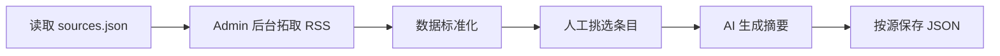

# 新闻胶囊 - 产品需求文档 (PRD)

> **产品愿景**：像吞服胶囊一样简单，在最短时间内获取不应错过的科技资讯

---

## 1. 产品概述

### 1.1 产品定位
一个「有限内容」的科技新闻阅读网站，通过每日精选高质量科技要闻，帮助用户：
- ✅ 不错过重要信息（大公司动向、新产品发布、行业变化）
- ✅ 快速了解事件背景与潜在影响
- ✅ 明确「读完了」的边界感，避免无限信息流焦虑

### 1.2 目标用户
- 科技从业者、产品经理、投资人
- 对科技行业感兴趣但时间有限的职场人士
- 希望高效获取信息而非沉浸式刷新闻的用户

### 1.3 核心差异化
| 传统新闻网站       | 新闻胶囊         |
| ------------------ | ---------------- |
| 无限信息流         | 按信息源分组展示 |
| 标题党吸引点击     | 一句话讲清楚事件 |
| 追求阅读时长       | 追求高效阅读     |
| 需要用户判断重要性 | 已预筛选重要信息 |

---

## 2. 功能规格

### 2.1 首页 - 极简阅读体验

#### 页面结构
```
┌─────────────────────────────────────────────┐
│  [Logo]  1月5日·周日  [◀][📅][▶]  [EN]      │  ← 固定顶栏
├─────────────────────────────────────────────┤
│  [≡] 内容目录 (12)                          │  ← 可折叠
│  ├── 01. Apple发布Vision Pro 2...           │
│  ├── 02. Google推出AI新功能...              │
│  └── ...                                    │
├─────────────────────────────────────────────┤
│  No. 01                                     │
│  ┌─────────────────────────────────────┐    │
│  │ The Verge                           │    │
│  │                                     │    │
│  │ Apple发布Vision Pro 2               │    │
│  │ 售价降至2499美元                     │    │
│  │                                     │    │
│  │ 编辑概要                            │    │
│  │ 苹果今日发布第二代Vision Pro...      │    │
│  │                                     │    │
│  │ • 要点1：重量减轻40%                 │    │
│  │ • 要点2：新增空间视频录制             │    │
│  │ • 要点3：...                        │    │
│  │                                     │    │
│  │ ┌─────────────────────────────────┐ │    │
│  │ │ 原文剩余营养  🍎🍎⚪              │ │    │
│  │ │ 原文包含详细技术规格和时间表...    │ │    │
│  │ │ 适合：产品经理、开发者            │ │    │
│  │ │                                  │ │    │
│  │ │ 用 5 分钟阅读原文 →               │ │    │
│  │ └─────────────────────────────────┘ │    │
│  └─────────────────────────────────────┘    │
│                                             │
│  No. 02 ...                                 │
├─────────────────────────────────────────────┤
│  喜欢新闻胶囊？ [订阅]                       │
├─────────────────────────────────────────────┤
│  意见反馈：xxx@email.com                    │
└─────────────────────────────────────────────┘
```

#### 新闻卡片设计（NewsCardLab）
每张卡片包含：
- **原始标题**：信息源的原始标题
- **编辑概要**（editorNote）：一句话概括事件（30-50字）
- **关键要点**（keyPoints）：3-4条核心信息
- **阅读原文评估**（readOriginal）：
  - 营养值：0-3 个苹果图标（🍎）
  - 理由：为什么值得/不值得读原文
  - 适合人群：什么读者应该阅读原文
- **阅读时长**：预估原文阅读时间
- **来源链接**：跳转原文

#### 阅读原文营养值说明

| 分数 | 图标 | 含义                    |
| ---- | ---- | ----------------------- |
| 3    | 🍎🍎🍎  | 不可替代的一手/独家材料 |
| 2    | 🍎🍎⚪  | 高密度参考资料          |
| 1    | 🍎⚪⚪  | 关键语境补充            |
| 0    | ⚪⚪⚪  | 摘要已覆盖核心信息      |

### 2.2 信息源分组展示

- 中文源在前，英文源在后
- 每个源内部按发布时间降序
- 保持 sources.json 中的顺序

### 2.3 订阅弹窗

点击「订阅」按钮后显示模态框：
```
┌─────────────────────────────────────────────┐
│           📬 订阅每日科技速递                │
│                                             │
│  每天早8点，将今日要闻发送到您的邮箱          │
│                                             │
│  ┌─────────────────────────────────────┐    │
│  │ 请输入邮箱地址                       │    │
│  └─────────────────────────────────────┘    │
│                                             │
│           [确认订阅]                        │
│                                             │
│  已有 1,234 位读者订阅                      │
└─────────────────────────────────────────────┘
```

> [!NOTE]
> MVP阶段仅收集邮箱，暂不发送邮件。

### 2.4 反馈系统

- 底部显示「意见反馈」链接
- 点击后弹出反馈表单
- 反馈内容存储到 `data/feedback.json`
- Admin 可在后台查看和管理反馈

### 2.5 管理后台 (/admin)

完整的内容管理系统，包含以下模块：

| 模块   | 路径                     | 功能                               |
| ------ | ------------------------ | ---------------------------------- |
| 编辑部 | `/admin`                 | 工作台总览，按状态管理新闻条目     |
| 信息源 | `/admin/sources`         | 信息源 CRUD，分组、排序、启用/禁用 |
| 已发布 | `/admin/published`       | 查看已发布内容，批量重新生成       |
| Prompt | `/admin/prompt-debugger` | Prompt 调试和测试                  |
| 设置   | `/admin/settings`        | 系统配置                           |
| 反馈   | `/admin/feedback`        | 用户反馈管理                       |

> 详见 [Admin PRD](./admin-prd.md)

---

## 3. 技术架构

### 3.1 技术栈选择

| 层级         | 技术                        | 理由                                      |
| ------------ | --------------------------- | ----------------------------------------- |
| **前端框架** | Next.js 16 (App Router)     | Vercel原生支持、SSG优化SEO、适合Agent开发 |
| **样式**     | Vanilla CSS + CSS Variables | 轻量、无依赖、易于Agent理解和修改         |
| **AI 摘要**  | OpenAI GPT-4o-mini          | 筛选、摘要生成、去重                      |
| **正文提取** | html-to-text                | 从 HTML 提取干净纯文本                    |
| **数据存储** | Cloudflare R2 / JSON文件    | 云端使用R2，本地开发使用文件系统          |
| **部署**     | Vercel                      | 自动部署、Cron定时任务                    |

### 3.2 项目结构

```
news-capsule/
├── app/
│   ├── layout.js          # 全局布局
│   ├── page.js            # 首页 (极简文学风格)
│   ├── globals.css        # 全局样式
│   ├── admin/             # 管理后台 (8个子页面)
│   └── api/
│       ├── feeds/         # ⭐ 主要 API
│       ├── dates/         # 可用日期
│       ├── subscribe/     # 订阅API
│       ├── feedback/      # 反馈API
│       ├── auth/          # 认证API
│       └── admin/         # Admin API
├── components/
│   ├── Header.js          # 顶部导航
│   ├── NewsCardLab.js     # ⭐ 新闻卡片（极简风格）
│   ├── DatePicker.js      # 日期选择器
│   ├── Footer.js          # 底部
│   ├── SubscribeModal.js  # 订阅弹窗
│   └── FeedbackModal.js   # 反馈弹窗
├── lib/
│   ├── storage.js         # ⭐ 存储抽象层 (R2/文件系统)
│   ├── prompts.js         # ⭐ Prompt 统一管理
│   ├── auth.js            # 认证逻辑
│   └── ...
├── scripts/
│   ├── generate-news.js   # ⭐ 新闻生成脚本
│   └── config.js          # 配置
├── data/
│   ├── sources.json       # ⭐ 信息源配置
│   ├── feeds/             # ⭐ 按源分组的数据
│   ├── subscribers.json   # 订阅者列表
│   └── feedback.json      # 用户反馈
└── docs/                  # 文档
```

### 3.3 数据结构

#### 信息源配置 (`data/sources.json`)
```json
{
  "version": 1,
  "sources": [
    {
      "id": "the-verge",
      "name": "The Verge",
      "url": "https://www.theverge.com/rss/index.xml",
      "language": "en",
      "category": "tech",
      "enabled": true,
      "addedAt": "2026-01-01T00:00:00Z"
    }
  ]
}
```

#### AI 摘要输出格式
```json
{
  "editorNote": "编辑概要，30-50字",
  "keyPoints": ["要点1", "要点2", "要点3"],
  "readOriginal": {
    "score": 2,
    "reason": "原文包含详细技术实现细节",
    "whoShouldRead": "需要动手实现的开发者"
  }
}
```

#### 新闻数据 (`data/feeds/{sourceId}/{date}-{lang}.json`)
```json
{
  "date": "2026-01-05",
  "language": "zh",
  "source": {
    "id": "the-verge",
    "name": "The Verge"
  },
  "items": [
    {
      "id": "the-verge-1736064000000-0",
      "originalTitle": "Apple announces Vision Pro 2...",
      "editorNote": "苹果今日发布第二代Vision Pro...",
      "keyPoints": ["要点1", "要点2", "要点3"],
      "readOriginal": {
        "score": 2,
        "reason": "原文包含详细技术规格",
        "whoShouldRead": "产品经理、开发者"
      },
      "readTime": "5 分钟",
      "wordCount": 1200,
      "source": {
        "name": "The Verge",
        "url": "https://..."
      },
      "pubDate": "2026-01-05T...",
      "status": "published",
      "publishedAt": "2026-01-05T10:00:00Z"
    }
  ]
}
```

---

## 4. 页面设计规范

### 4.1 设计风格（极简文学风）
- **极简克制**：无多余装饰，突出内容本身
- **清晰层次**：通过留白和字重区分信息层级
- **舒适阅读**：大字号、高对比度、充足行距
- **报纸质感**：序号标注、等宽字体细节
- **扁平设计**：无渐变、简洁边框

### 4.2 色彩系统

```css
:root {
  /* 背景 */
  --bg-primary: #ffffff;
  --bg-secondary: #f7f6f3;
  --bg-hover: #efefef;
  
  /* 文字 */
  --text-primary: #37352f;
  --text-secondary: #6b6b6b;
  --text-muted: #9b9a97;
  
  /* 边框 */
  --border-light: #e3e2de;
  --border-divider: #ebebea;
  
  /* 强调色 */
  --accent: #2383e2;
  --accent-hover: #0b6bcb;
}
```

### 4.3 字体

```css
font-family: 'Inter', -apple-system, BlinkMacSystemFont, 'Segoe UI', sans-serif;
```

---

## 5. 内容来源策略

### 5.1 信息源配置

信息源通过 `data/sources.json` 统一管理，可通过 Admin 面板 (`/admin/sources`) 配置：

**英文来源**
- The Verge
- TechCrunch
- Ars Technica
- 等...

**中文来源**
- 极客公园
- 36氪
- 虎嗅
- 等...

### 5.2 内容生产流程



> [!NOTE]
> 新闻的挑选和发布通过 Admin 后台手动操作

---

## 6. 开发计划

### Phase 1: 静态原型 ✅
- [x] 项目初始化 (Next.js)
- [x] 设计系统 (CSS Variables)
- [x] Header/NewsCard/Footer组件
- [x] 首页布局和订阅弹窗

### Phase 2: 数据与API ✅
- [x] RSS聚合抓取（多信息源）
- [x] AI筛选和摘要生成
- [x] 中英文界面切换
- [x] Vercel Cron定时任务

### Phase 3: 架构优化 ✅
- [x] 数据按源分组存储
- [x] 统一信息源配置 (sources.json)
- [x] Admin 管理后台
- [x] 数据标准化 (HTML→纯文本)
- [x] AI 去重机制

### Phase 4: 部署上线 ✅
- [x] Vercel部署配置
- [x] 环境变量配置

### Phase 5: 功能扩展 ✅
- [x] R2 云存储迁移（替代 Vercel Blob）
- [x] Admin 后台扩展（8个子页面）
- [x] 首页 UI 升级（极简文学风格）
- [x] Prompt 统一管理
- [x] 认证系统
- [x] 用户反馈系统
- [x] 新输出格式（editorNote/keyPoints/readOriginal）

---

## 7. 验证计划

### 7.1 本地开发测试
```bash
# 启动开发服务器
npm run dev

# 验证项目
# 1. 访问 http://localhost:3000 检查首页渲染
# 2. 确认按源分组的新闻卡片正确显示
# 3. 点击"订阅"按钮，验证弹窗显示
# 4. 测试日期切换和语言切换功能
# 5. 测试内容目录导航功能
```

### 7.2 浏览器兼容性
- Chrome (最新版)
- Safari (最新版)
- Firefox (最新版)
- 移动端响应式布局

---

## 8. 已确认事项

- ✅ **产品名称**：新闻胶囊
- ✅ **展示方式**：按信息源分组
- ✅ **设计风格**：极简文学风
- ✅ **数据存储**：Cloudflare R2 (云端) / JSON文件 (本地)
- ✅ **AI 输出格式**：editorNote + keyPoints + readOriginal

---

## 附录：产品理念

> 💊 **新闻胶囊** - 像吞服胶囊一样简单
> 
> 在最短时间内获取不应错过的科技资讯，不多也不少，刚刚好。
